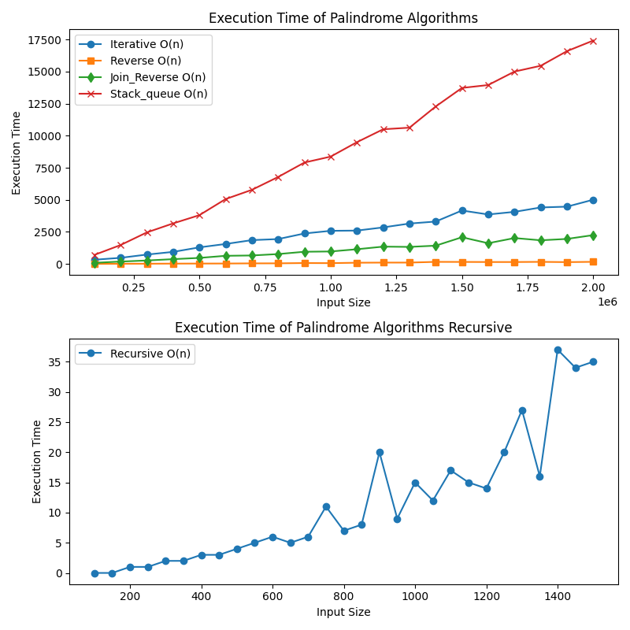
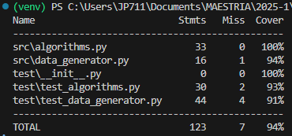

# ALDA 2025 Palindrome Algorithms

This project implements and evaluates various algorithms to determine whether a given string is a palindrome. It also includes automated tests to ensure the correctness of the implementations and a performance analysis of the algorithms.

---

## Introduction

A palindrome is a string that reads the same backward as forward, such as "racecar" or "12321". This project explores different approaches to check if a string is a palindrome, evaluates their performance, and visualizes the results.

---

## Project Structure

The project is organized as follows:

ALDA_2025_Palindrome_Algorithms/ │ ├── src/ │ ├── algorithms.py # Implementation of palindrome algorithms │ ├── execution_time_gathering.py # Module for measuring execution time │ ├── test/ │ ├── test_algorithms.py # Unit tests for palindrome algorithms │ ├── test_data_generator.py # Unit tests for random string generation │ ├── app.py # Main script for performance analysis and plotting ├── requirements.txt # List of dependencies ├── README.md # Project documentation └── LICENSE # License file

## Algorithms

The following algorithms are implemented in [`src/algorithms.py`](src/algorithms.py):

1. **Iterative Approach**:
   - Compares characters from the start and end of the string moving toward the center.
   - Complexity: O(n).

2. **Reverse Approach**:
   - Reverses the string and compares it with the original.
   - Complexity: O(n).

3. **Recursive Approach**:
   - Recursively compares the first and last characters, reducing the string size at each step.
   - Complexity: O(n).

4. **Join and Reverse Approach**:
   - Uses Python's `reversed()` function and joins the characters to form the reversed string.
   - Complexity: O(n).

5. **Stack and Queue Approach**:
   - Uses a stack and a queue to compare characters in reverse and original order.
   - Complexity: O(n).

---

## Virtual Environment Setup and Usage

### What is a Virtual Environment?

A virtual environment is an isolated Python environment that allows you to manage dependencies for your project without affecting the global Python installation. It ensures that your project uses the correct versions of libraries and avoids conflicts with other projects.

### Creating a Virtual Environment

To create a virtual environment for this project, follow these steps:

1. Open a terminal in the project directory.
2. Run the following command to create the virtual environment:

   ```sh
   python -m venv venv
   ```
This will create a folder named [`venv`](/venv) in the project directory.

3. Activate the virtual environment:
    ```sh
    venv/bin/activate
    ```
4. Install the required dependencies:
    ```sh
    pip3 install -r requirements.txt
    ```
Importance of a Virtual Environment:
- Dependency Management: Ensures that the project uses the correct versions of libraries specified in requirements.txt.
- Isolation: Prevents conflicts between dependencies of different projects.
- Reproducibility: Makes it easier for others to set up and run the project with the same environment.


## Testing

Automated tests are implemented using Python's `unittest` framework. The tests ensure the correctness of the algorithms and the random string generation functions.

- **Algorithm Tests**: Located in [`test/test_algorithms.py`](test/test_algorithms.py), these tests validate the correctness of each palindrome-checking algorithm using various test cases.
- **Data Generator Tests**: Located in [`test/test_data_generator.py`](test/test_data_generator.py), these tests verify the random string generation functions, including the generation of palindromes.

##  Results
The performance of the palindrome algorithms was tested using input sizes ranging from **10,000** to **200,000** characters, with increments of **10,000**. For each input size, multiple samples were generated, and the execution time of each algorithm was measured. The results were analyzed to compare the efficiency of the algorithms.

### Observations

1. **Iterative Approach**:
   - Performs consistently well across all input sizes.
   - Minimal overhead due to its straightforward implementation.
   - Recommended for large-scale inputs.

2. **Reverse Approach**:
   - Slightly slower than the iterative approach due to the overhead of creating a reversed string.
   - Still efficient for most input sizes.

3. **Join and Reverse Approach**:
   - Similar performance to the reverse approach but with additional overhead from joining characters.
   - Suitable for medium-sized inputs.

4. **Stack and Queue Approach**:
   - The slowest among the non-recursive algorithms due to the use of additional data structures (stack and queue).
   - Not recommended for large inputs.


5. **Recursive Approach**:
   - Performs similarly to the iterative approach for small input sizes.




 
 ### Conclusion

- The **Iterative Approach** is the most efficient and reliable algorithm for palindrome checking, especially for large input sizes.
- Recursive algorithms, while conceptually elegant, are not practical for large inputs due to Python's recursion depth limitations.


##  Coverage

Coverage generates a report showing what percentage of each code file was covered during testing. The report also shows a summary of the total coverage for the entire project. In this case, 86% of the code was covered during testing.



